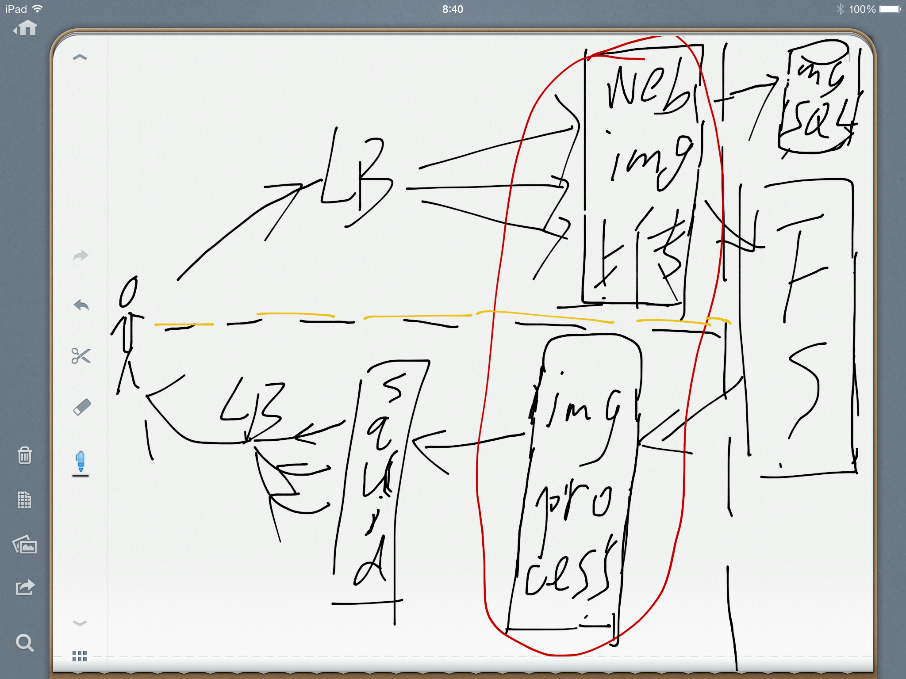

flyimage
========

Image processing server using OpenResty and Lua.

### Install Guide

$ brew install imagemagick

* Install an enhanced distribution of Nginx which called OpenResty.

$ luarocks install --server=http://rocks.moonscript.org magick

### ImageMagick

ImageMagick is a software suite to create edit compose or convert bitmap images.
It can read and write images in a variety of formats. You can use ImageMagick to
resize flip mirror rotate distort shear and transform images, adjust image colors
or draw text. The functionality of ImageMagick is typically utilized from the command
line or you can use the features from programs.
See[ImageMagick](http://www.imagemagick.org/script/index.php)

The [MagickWand API](http://www.imagemagick.org/script/magick-wand.php) is the recommonded
interface between the C programming languages and the ImageMagick image processing libraries.
And with `lua` language and `luajit` compiler, you can use C libraries in lua programming using
`FFI`, so I will use lua. Besides `MagickWand API`, it also provides
[MagickCore API](http://www.imagemagick.org/script/magick-core.php) which is a low-level interface
between the C programming language and the ImageMagick image processing libraries. And it is
recommended for wizard-level programmers only.

### Outline

Each image will be save once, and md5 hash value of image will be save to `mysql` to
ensure no same images were uploaded. Becauseof the high `CPU` spending of processing
images, so we should add a signature of every single processed image or Eventhough, we should
add a whitelist to limit request specific processed images(for example only 100x100 and 200x200
images can be requested). Without doing that someone can attack your server with a large quantity
of different size image requests and then your `CPU` load will be high quickly.

### Notes

* url

    /images/SIGNATURE/SIZE/PATH

    /images/xfdsa12/100x100/hash.jpeg

    hash is the md5 of image to avoid the same image is saved

    SIGNATURE is the hash of SIZE/PATH(100x100/hash.jpeg)

* Nginx

    Nginx images store and cache module....
